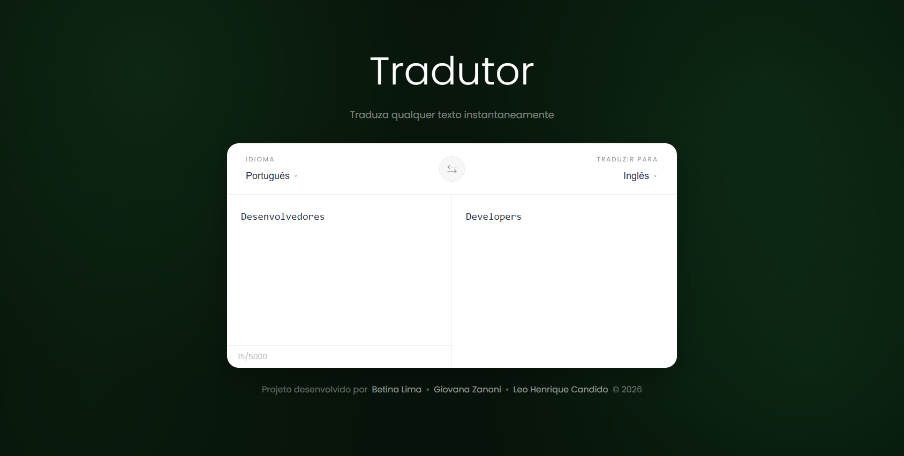

# Tradutor-Langchain-Langgraph

## Descrição

Este projeto é uma aplicação Full Stack desenvolvida para demonstrar a utilização de Inteligência Artificial com LangChain e LangGraph na construção de um fluxo de tradução automática. A aplicação permite que o usuário escreva um texto, selecione o idioma de destino e receba a tradução através de uma interface web moderna. Todo o processamento é realizado localmente utilizando Ollama e o modelo Llama 3.2 3B.

## Tecnologias utilizadas

### Frontend

- React
- TypeScript
- CSS3
- Fetch API

### Backend

- Node.js
- TypeScript
- Express
- LangChain
- LangGraph
- Ollama
- Llama 3.2 3B

## Instalação

Clone o repositório

```bash
git clone https://github.com/giovanazanonii/tradutor-langchain-langgraph.git
```

Entre na pasta do projeto

```bash
cd tradutor-langchain-langgraph
```

### Backend

Entre na pasta

```bash
cd backend
```

Instale as dependências

```bash
npm install
```

Inicie o Ollama

```bash
ollama serve
```

Caso o modelo ainda não esteja instalado

```bash
ollama pull llama3.2:3b
```

Execute o servidor

```bash
npm run dev
```

O backend ficará disponível em

```
http://localhost:3000
```

### Frontend

Abra outro terminal

```bash
cd frontend
```

Instale as dependências

```bash
npm install
```

Execute a aplicação

```bash
npm run dev
```

O frontend ficará disponível em

```
http://localhost:5173
```

## Tratamento de erros

A API realiza validação dos dados recebidos.

Exemplos:

- texto obrigatório
- idioma obrigatório
- texto vazio
- idioma vazio

## Estrutura do projeto

```text
tradutor-langchain-langgraph/
│
├── assets/
│   └── Tradutor.png
│
├── backend/
│   └── src/
│       ├── graph/
│       │   └── grafo-tradutor.ts
│       │
│       ├── routes/
│       │   └── translate.ts
│       │
│       ├── app.ts
│       └── server.ts
│
├── frontend/
│   └── src/
│       ├── services/
│       │   └── api.ts
│       │
│       ├── styles/
│       │   └── global.css
│       │
│       ├── App.tsx
│       └── main.tsx
│
└── README.md
```

## Autores

Desenvolvido por:

- [**/betinalimaj**](https://github.com/betinalimaj)
- [**/giovanazanonii**](https://github.com/giovanazanonii)
- [**/leozhxl**](https://github.com/leozhxl)

---

<h2 align="center">Page Tradutor</h2>

<p align="center">
  
</p>
